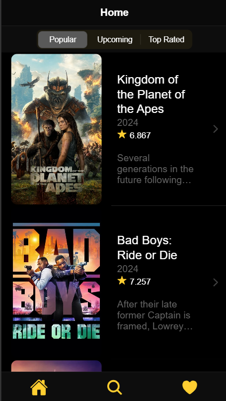
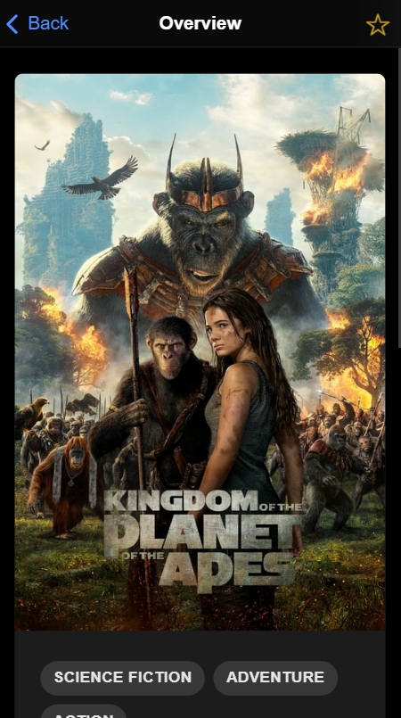

# Movie-app-ionic

Movie-app es una aplicación web desarrollada con Ionic que utiliza la API de The Movie Database (TMDB) para mostrar información sobre películas. Además, permite a los usuarios autenticarse con sus cuentas de TMDB y añadir películas a su lista de favoritos, que se sincroniza con su cuenta en TMDB.

## Capturas de Pantalla


*Página de inicio - Muestra películas populares.*


*Detalles de película - Información detallada de una película.*

## Características

- Explorar películas populares, próximos lanzamientos, etc.
- Buscar películas por título.
- Ver detalles de una película específica.
- Autenticarse con una cuenta de TMDB.
- Añadir y quitar películas de tu lista de favoritos (se sincroniza con tu cuenta de TMDB).

## Instalación

Para ejecutar este proyecto localmente, sigue estos pasos:

1. Clona este repositorio:

```bash
git clone https://github.com/tu_usuario/movie-app-ionic.git
