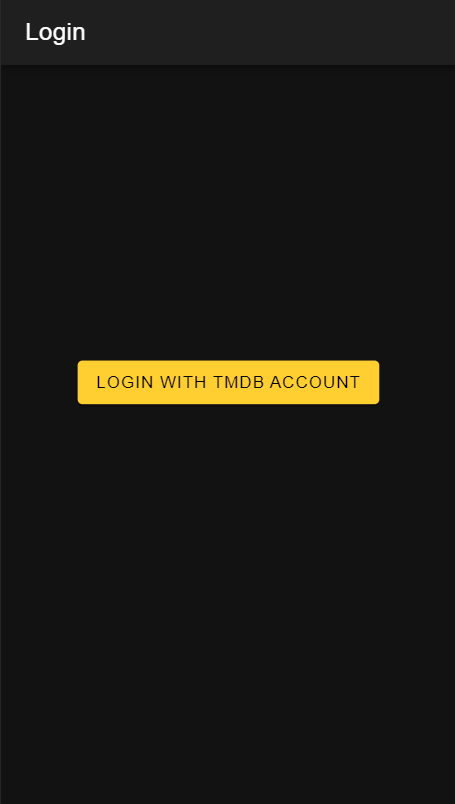
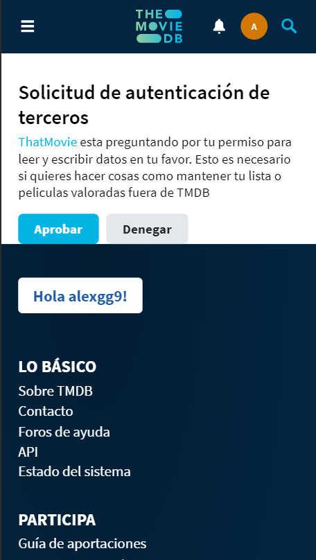
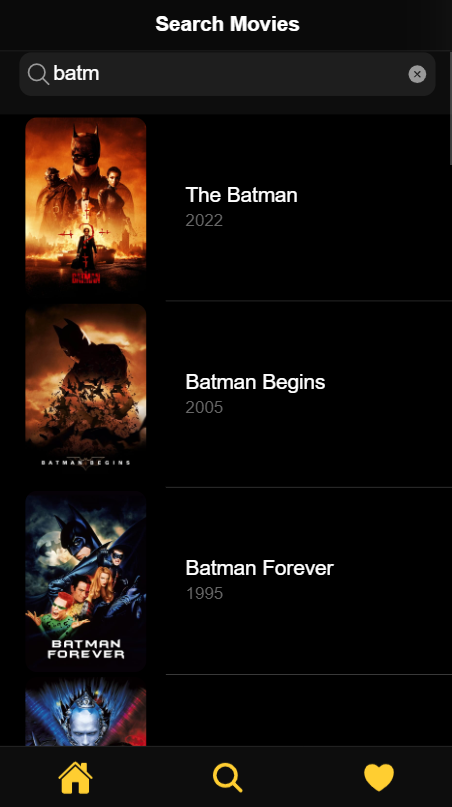
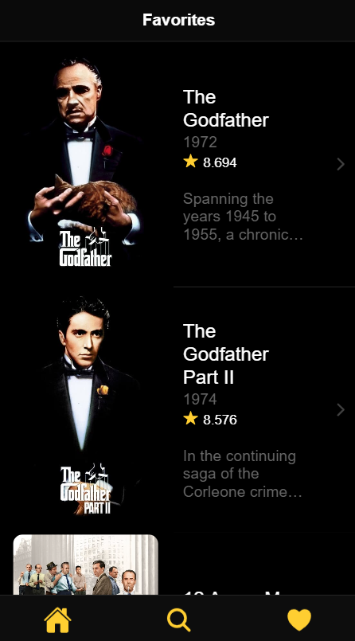

# Movie-app-ionic

Movie-app es una aplicación web desarrollada con Ionic que utiliza la API de The Movie Database (TMDB) para mostrar información sobre películas. Además, permite a los usuarios autenticarse con sus cuentas de TMDB y añadir películas a su lista de favoritos, que se sincroniza con su cuenta en TMDB.

## Capturas de Pantalla

# Movie-app-ionic

Movie-app es una aplicación web desarrollada con Ionic que utiliza la API de The Movie Database (TMDB) para mostrar información sobre películas. Además, permite a los usuarios autenticarse con sus cuentas de TMDB y añadir películas a su lista de favoritos, que se sincroniza con su cuenta en TMDB.

## Capturas de Pantalla
<div align="center">
  
  <p><em>Página de Login - Login con la cuenta de TMDB.</em></p>
</div>

<div align="center">
  
  <p><em>Redicrección a TMDB - Confirmación con TMDB para el acceso y solicitud del token.</em></p>
</div>

<div align="center">
  
  <p><em>Página de inicio - Muestra películas populares.</em></p>
</div>

<div align="center">
  
  <p><em>Detalles de película - Información detallada de una película.</em></p>
</div>

<div align="center">
  
  <p><em>Busqueda - Busqueda de películas.</em></p>
</div>

<div align="center">
  
  <p><em>Películas favoritas - Películas favoritas que se añadiran a nuestra cuenta de TMDB.</em></p>
</div>

## Características

- Explorar películas populares, próximos lanzamientos, etc.
- Buscar películas por título.
- Ver detalles de una película específica.
- Autenticarse con una cuenta de TMDB.
- Añadir y quitar películas de tu lista de favoritos (se sincroniza con tu cuenta de TMDB).

## Instalación

Para ejecutar este proyecto localmente, sigue estos pasos:

1. Clona este repositorio:

```bash
git clone https://github.com/tu_usuario/movie-app-ionic.git
```
2. Instala las dependencias:

```
cd movie-app-ionic
npm install
```
3. Configura las variables de entorno:

Obtén tu propia API Key de TMDB en [TMDB Api](https://developer.themoviedb.org/reference/intro/getting-started).

4. Inicia la aplicación:

Asegurate de tener instalado Node.js, Ionic y Angular para ejecutar la app.

```
ionic serve -o
```

